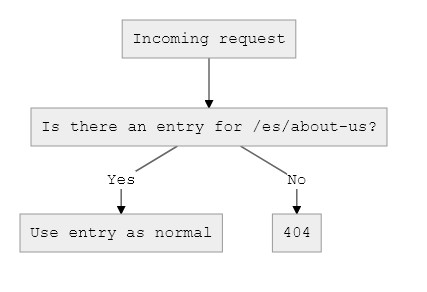

# Fallback Site for Craft 3

This plugin allows each site to fall back to another site when a requested element cannot be found. This allows multi-site installations (typically for multiple languages) to gracefully fall back to existing content if available.

When a request is made for an element that would normally not be found, *Fallback Site* will check the configured site for an element with the same slug. For example, if you have an English site and a Spanish site as part of your craft install, and English is the fallback for Spanish, then handling for a request to the Spanish site would go as follows:

* First, if an element was found on the Spanish site, everything continues as normal, and *Fallback Site* does not intervene.
* If an element was not found on the Spanish site, *Fallback Site* checks if there is an English element with the same the slug.
* If an English element is found, then that element's ID is used to see if there is a Spanish version available, which can happen if an incorrect, untranslated slug is used.
	* If a Spanish version exists, then a 301 redirect will be sent to the user, directing them to the correct URL.
	* If a Spanish version does not exist, then *Fallback Site* makes Craft use the English element in place of the Spanish one (With some conditions listed below).
* If an English element is not found, then the request continues as a 404 as normal.

See the flowcharts below which demonstrate what happens when requesting a page, `about-us`, under a secondary, Spanish site (located at `/es`) within a multi-site Craft installation.

**Normal Craft element handling**



**Element handling with Fallback Site**


## Requirements

* Craft CMS 3.0.0-RC1 or above

## 
1. Open a terminal and navigate to your project folder:

```bash
cd /path/to/project
```

2. Require the package to download it via Composer:

```bash
composer require charliedev/fallback-site
```

3. Install the plugin on the `Settings -> Plugins` page in the Craft control panel.

**--- or ---**

3. Install the plugin via the command line:

```bash
./craft install/plugin fallback-site
```

## Configuration

Within the Craft control panel, go to the `Settings -> Plugins` page, and then look for the `Settings` button listed by the *Fallback Site* plugin.

Here, you can select which site acts as a fallback for each other site. Keep in mind, if a site is a fallback for itself, no further fallbacks are checked. Fallbacks can also be chained across multiple sites, each site falling back to the next.

## Usage

While the plugin works without any additional configuration, you may want to know if an entry being displayed has been substituted by *Fallback Site*. This may be done to display notices about the availability of site-specific content, or notify users of the replacement. Detecting this can be done by comparing the current site stored by Craft with the entry's associated site.

```

	{# Entry content is coming from a different site. #}

{# ... or ... #}

	{# Entry content is in a different language. #}

```

---

*Built for [Craft CMS](https://craftcms.com/) by [Charlie Development](http://charliedev.com/)*
